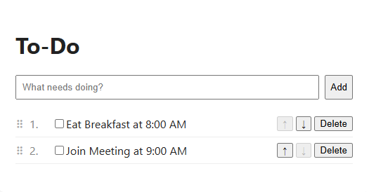

# README

# To-Do App

A full-stack to-do list built with **React**, **FastAPI**, and **MongoDB**. Create tasks, check them off, delete them, and drag them into any order. Everything is saved to a cloud database, so your list and its order persist across page refreshes and server restarts.



## Features

- Add, complete, and delete tasks
- Reorder tasks with drag and drop, or with the up and down arrow buttons
- Order is saved to the database and restored on reload
- Optimistic UI updates: changes appear instantly and roll back automatically if the server request fails
- Input validation and clear error responses from the API
- Interactive API documentation generated automatically by FastAPI

## Tech Stack

| Layer | Technology |
| --- | --- |
| Frontend | React, Vite, JavaScript, CSS |
| Backend | Python, FastAPI, Pydantic, Uvicorn |
| Database | MongoDB Atlas, PyMongo |
| Tooling | ESLint, Git, GitHub |

## Project Structure

```
todo-app/
├── backend/
│   ├── main.py            # FastAPI app: routes, models, database access
│   ├── requirements.txt   # Python dependencies
│   └── .env               # MongoDB connection string (not committed)
└── frontend/
    ├── src/
    │   ├── App.jsx        # Main React component and API calls
    │   ├── index.css      # Styles
    │   └── main.jsx       # React entry point
    └── package.json       # Node dependencies and scripts
```

## API Endpoints

| Method | Endpoint | Description |
| --- | --- | --- |
| GET | `/todos` | List all tasks, sorted by position |
| POST | `/todos` | Create a task (added to the end of the list) |
| PATCH | `/todos/{id}` | Toggle a task between done and not done |
| DELETE | `/todos/{id}` | Delete a task |
| PUT | `/todos/order` | Save a new task order from a list of IDs |

Full interactive docs are available at `http://localhost:8000/docs` while the backend is running.

## Getting Started

### Prerequisites

- [Node.js](https://nodejs.org/) 18 or later
- [Python](https://www.python.org/) 3.10 or later
- A free [MongoDB Atlas](https://www.mongodb.com/cloud/atlas) cluster

### 1. Clone the repository

```bash
git clone https://github.com/moatazhikal5-max/todo-app.git
cd todo-app
```

### 2. Set up the backend

```bash
cd backend
python -m venv .venv
```

Activate the virtual environment:

```bash
# Windows (PowerShell)
.\.venv\Scripts\Activate.ps1

# macOS / Linux
source .venv/bin/activate
```

Install dependencies:

```bash
pip install -r requirements.txt
```

Create a `.env` file in the `backend` folder with your MongoDB Atlas connection string:

```
MONGODB_URI=mongodb+srv://<username>:<password>@<cluster-url>/?appName=Cluster0
```

Start the API server:

```bash
uvicorn main:app --reload
```

The API runs at `http://localhost:8000`.

### 3. Set up the frontend

In a second terminal:

```bash
cd frontend
npm install
npm run dev
```

The app runs at `http://localhost:5173`.

## Design Notes

**Ordering uses a separate `position` field, not the task IDs.** An ID is a task’s permanent identity, so changing it would break anything that refers to that task. Reordering only updates each task’s `position`, and all position updates are sent to MongoDB in a single `bulk_write` call.

**Toggling is atomic.** Completing a task flips its status in one database operation using an update pipeline, which avoids race conditions when two requests arrive at the same time.

**CORS is restricted** to the local frontend origin rather than allowing every site.

**Secrets stay out of the repo.** The database connection string lives in a `.env` file that is excluded by `.gitignore`.

## Roadmap

- Deploy to AWS (frontend on S3, API on Lambda or EC2) using Terraform
- User accounts so each person has their own list
- Due dates and task categories
- Automated tests for the API and frontend

## Author

**Moataz Hikal** · [GitHub](https://github.com/moatazhikal5-max)